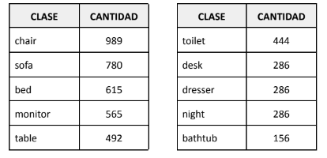
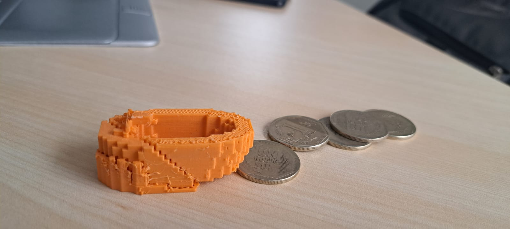
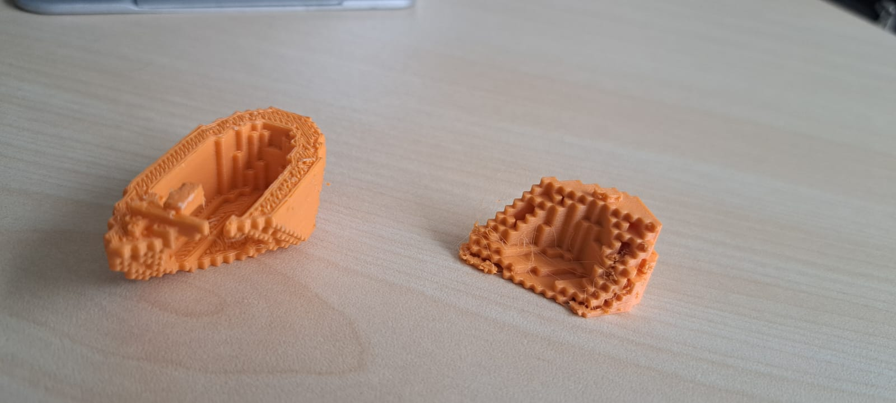

# Trabajo Final Machine Learning
### Curso: CC57 - Machine Learning
### Sección CC72
### Profesor: Canaval Sánchez, Luis Martín
### Alumnos
- Arroyo Bonifaz, Luis Roberto u201716094
- Basauri Quispe, Roberto Carlos u20181c074
- Osorio Guerra, Cesar Javier u201314396
- Teixeira Walters, Jett Manuel u201315252

# Introducción

La reconstrucción de objetos utilizando Machine Learning es una técnica en la que se utiliza un
conjunto de datos para poder entrenar un modelo que recrea modelos tridimensionales precisos de
distintos objetos. Esto se logra a través del uso de algoritmos de aprendizaje que analizan los
patrones que están presentes en las imágenes y podrá inferir su geometría en 3D. La reconstrucción
es utilizada en aplicaciones como la fabricación, la robótica y la visualización de objetos en realidad
virtual.

# Objetivos
- Leer correctamente un conjunto de datos que contenga un modelo de algún objeto en 3D.
- Realizar las transformaciones pertinentes al modelo hacia un formato adecuado.
- Desarrollar un algoritmo que sea capaz de ocasionar fracturas en objetos 3D.
- Reconstruir el objeto 3D a través de la creación de algoritmos de aprendizaje.

# Formatos a utilizar

- TL: Por sus siglas “Standard Triangle Language” es un archivo que guarda los puntos de los
triángulos con su vector normal. Es una de las extensiones más utilizadas por las impresoras 3D.

- OFF: Por sus siglas “Object File Format” es un archivo que guarda polígonos 2D o 3D, puede
contener el color RGB. Es utilizado en múltiples bases de datos, juegos, ejemplos, etc. para el
modelado de objetos 3D.

# Datasets 

- ModelNet10: Dataset que tiene diferentes clases de objetos modelados en 3D en formato OFF.

 
</img>

# Impresoras 3D

Las impresoras 3D a utilizar son proveídas por la UPC. A continuación indicamos la lista de estas:

- FORM 2: Tecnología SLA, soporte de archivos STL. Insumo Recina

- SINDOH 3DWOX2X: Tecnología FFF, soporte de archivos STL. Insumos PLA y ABS.

# Formatos usados en Machine Learning 

Dentro del machine learning aplicado a objetos tridimensionales, la data varía de lo aprendido con
anterioridad, estos formatos difieren de lo usualmente visto que eran contenidos en arrays de una a
dos dimensiones, los formatos en machine learning, entre los más conocidos, son:

- Point Cloud: En un Point Cloud, cada objeto está representado por una serie de puntos que
son coordenadas tridimensionales, esta nube de puntos es capturada por sensores o
convertidos de formatos tipo mesh.
- Mesh: Un archivo tipo Mesh, captura la geometría del objeto, los puntos, aristas y caras. Un
tipo de mesh, y el que se usó para este trabajo, es el polygon mesh, el cual consiste en
representar un objeto con caras o con la forma de triángulos o cuadrados.
- Volumetric Display: Este tipo de formato es un tipo de formato de objeto sólido, y hecho de
voxels. Los voxels son el equivalente a los píxeles de las imágenes.

#  Algoritmo Generador de Rupturas

Explicación del algoritmo utilizado para generar los huecos.

Para generar rupturas en el modelo se tuvo la idea de quitar puntos, como quitar partes de una
imagen 2D que se contuviera en una matriz de dos dimensiones. Esta idea fue descartada debido a
que el modelo debía trabajar en formato .STL (formato que era soportado por las impresoras 3D),
este tipo de formato describe la superficie de un objeto como una malla triangular o en inglés
“triangular mesh”, esto no es otra cosa que percibir el objeto como un conjunto finito de triángulos
dispersos que le dan forma al objeto en cuestión (3D Systems Inc, 1988).

Habiendo descartado la primera idea, se propuso una idea frecuentemente vista en el curso de
Cálculo 2, el cual era intersección de descripciones en tres dimensiones. La descripción como tal no
nos interesaba, sino más bien la intersección de descripciones. Teniendo como objetivo ahora
interceptar el modelo 3D con una descripción de plano, debíamos buscar la forma de hacerlo.

Entre la búsqueda encontramos la librería trimesh, el cual es una librería de python para cargar y
manipular mallas triangulares o “triangular mesh”. Esta librería maneja una función llamada
“trimesh.slice_plane” el cual, corta la malla con un plano retornando una nueva malla que es una
porción de la malla original de la parte positiva del plano (Dawson, 2019).

La parte positiva del plano se refiere a la dirección de la normal. (Hay graficadores de vectores que
nos facilitan calcular esta dirección como geogebra 3D)

Ya que esta función hace lo que buscábamos, cortar el modelo con una descripción, en este caso un
plano, que es construido en base a una normal “plane_normal” y a un punto del plano que
queremos “plane_origin”, con esto solo nos faltaría delimitar el “punto” o “plane_origin”.

### Algoritmo

Del punto esperamos que:
1. Esté contenido en el plano que va a cortar y,

2. Que esté dentro de los límites abordados por el modelo 3D.

Tomando en consideración eso se planteó lo siguiente:

1. Delimitar un porcentaje de cercanía al centro o promedio aritmético de los límites del
modelo, límites que obtenemos mediante el “mesh.bounds”. Buscamos una cercanía al
centro considerando que cerca a este, el corte será lo suficientemente seguro para que
obtengamos un resultado que no sea “None”. Básicamente que hayamos hecho realmente
un corte.

2. Segundo es obtener la distancia entre el centro y los puntos, es decir, del punto -10 al 10, el
centro es 0, y la distancia es 10. Esta distancia (pasando el ejemplo a forma tridimensional),
sería multiplicado por este “porcentaje de cercanía”, y luego sumado al centro, de esta
forma, tener un objeto realmente roto y con un buen porcentaje de contenido (ya que
estamos jugando cerca al centro).

Ya teniendo el punto aleatorio y plano resultante, pasamos a aplicar la función y luego de forma
iterativa, realizar N cortes. Esto con la finalidad de dar a entender que el objeto realmente está roto.
Y haya generado N partes del objeto original.

# Resultados Obtenidos

</img>
</img>

# Modelo de reconstrucción

Para el modelo de reconstrucción se tuvo la tentativa por optar por una GAN.
Las GAN son una opción adecuada ya que estos se utilizan para generar datos realistas a partir de una distribución de datos de entrenamiento.
Las GAN son conformadas por dos modelos, el artista o generador, y el discriminador.
Ambos modelos son entrenados simultáneamente. Mientras que el artista va creando, la función del discriminador, el cual recibe todo el conjunto de datos de entrenamiento, es de tachar o aprobar los resultados del generador. 
Para el desarrollo, se propuso darle como dato de entrada al generador la pieza dañada. Este generaría modelos 3D de la pieza reconstruida. Mientras que al discriminador se le entrenaría con un conjunto de datos que contiene imágenes o modelos 3D de piezas completas y dañadas. La función del discriminador sería la de decidir si la pieza generada por el artista es el valor esperado. Mientras que la función del artista sería la de engañar al discriminador con sus valores generados.

# Bibliografía

3D Systems Inc (1988). StereoLithography Interface Specification.
https://www.loc.gov/preservation/digital/formats/fdd/fdd000504.shtml#:~:text=The%20STL%20(STe
reoLithography)%20file%20format,dimensional%20surface%20in%20triangular%20facets

Dawson (2019). Trimesh, Python Library.
https://trimsh.org/trimesh.base.html#trimesh.base.Trimesh.slice_plane

ModelNet10 - Princeton 3D Object Dataset
https://www.kaggle.com/datasets/balraj98/modelnet10-princeton-3d-object-dataset

Maynard-Reid, M. (2022, September 27). Intro to 3D deep learning. Towards Data Science.
https://towardsdatascience.com/intro-to-3d-deep-learning-e992f7efa6ee

SIPIRAN PAPER https://arxiv.org/abs/1711.06363

Vectores R3. GeoGebra. Retrieved May 13, 2023, from https://www.geogebra.org/m/spcrwrwk

# Anexos
